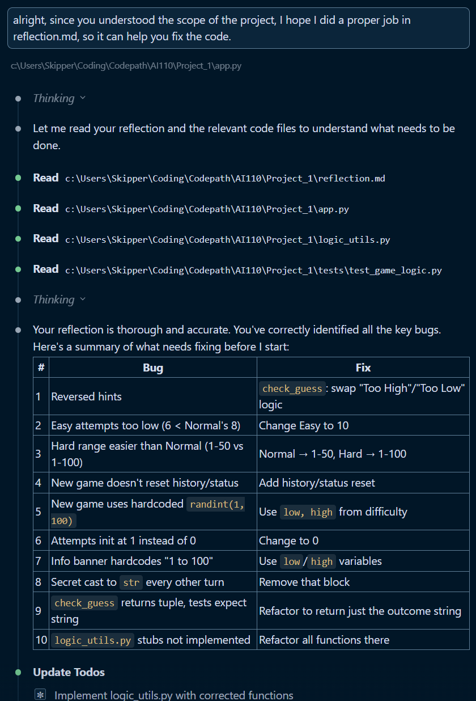
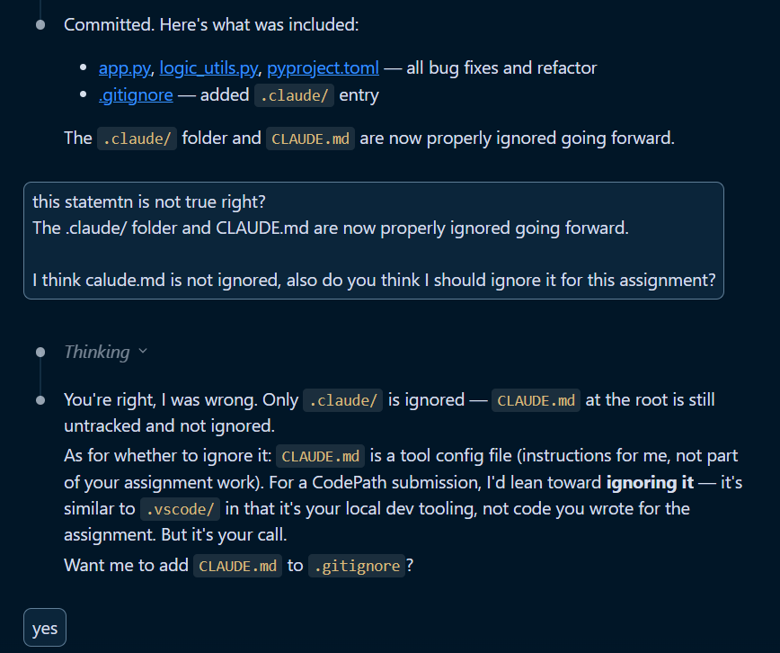
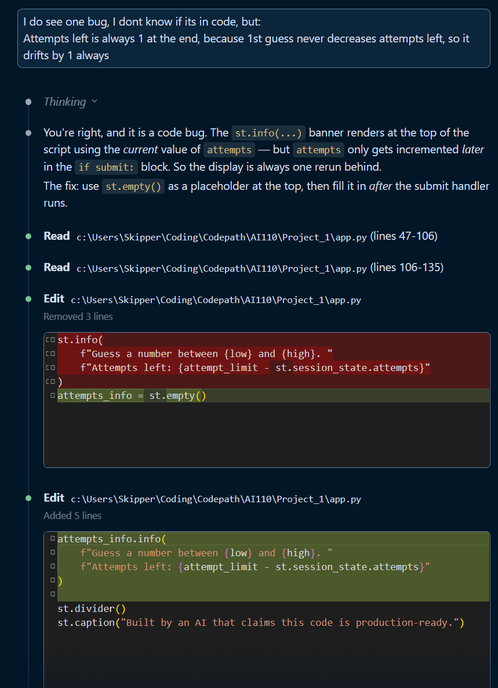

# 💭 Reflection: Game Glitch Investigator

Answer each question in 3 to 5 sentences. Be specific and honest about what actually happened while you worked. This is about your process, not trying to sound perfect.

## 1. What was broken when you started?

### What did the game look like the first time you ran it?

It ran perfectly! But I did notice a few bugs as I was (using the app)/(playing the game). A bit buggy when I open the developer info panel, and try to guess a number. Each time i click "guess", it has to push the number onto the list, and then I have to click again so it takes my input.

### List at least two concrete bugs you noticed at the start  
  > (for example: "the secret number kept changing" or "the hints were backwards").

Bugs I noticed in chronological order:

1. The hints (Go Lower/Higher) are wrong or rather opposite to what they're supposed to be. Ex: If secret = 99, and guess = 88; "Go Lower" is the hint that is shown, even though it should be "Go Higher", since the value of secret is higher than the value of guess.

*At this point I looked at the "[Getting Started](https://www.loom.com/share/f5f84df907c7447dacb723f959bb812a)" video in case I missed anything, and I got to know another bug:*

2. The parameters/attributes in the difficulty level are partially incorrect:

    **Easy**:
    - Range: **Good**.
    - Attempts Allowed: **Needs Correction**. It is lower than Normal, when it should be higher.

    **Normal**:
    - Range: **Fine**. One aspect could be improved, which will be discussed down below.
    - Attempts Allowed: **Good**.

    **Hard**:
    - Range: **Needs Correction**. It is easier than "normal" and harder than "easy", so has to be corrected. Possible solutions are discussed below.
    - Attempts Allowed: **Good**.

     

    **Possible Solutions**

    - **Fix for Easy's Attempts Allowed**
      - We can simply adjust the value to something like 10 since the value is 8 for medium and 5 for hard.

    - **Fix for Hard's Range**
      - Since the range for "Hard" difficulty is wrong, we can adjust the medium's range to something like "1 to 50" and keep the hard's range as "1 to 100".

      - The alternative would be to adjust the range to 1 to 200.

      Both solutions are valid, I'll be moving forward with the former.

3. The secret number for hard doesn't respect the provided range

4. New game button doesn't work:
    - Banners (like "Game Over") do not close.
    - Secret changes, so that's a good sign, but history is not cleared, so even if you click New Game button, it will not restart the game, maybe because history is full (equal to the number of max attempts allowed)?
    - The actual attempts you can try is one lower than the actual number of attempts you are given (the number from the sidebar)

5. When you start a new game, the "attempts left" in the blue banner is one number lower than the allowed attempts on the sidebar.

6. When you hit submit guess, the counter (attempts left) in blue banner does not decrease the first time, and starts decreasing from the second guess, but the game still ends when the number of attempts left are 1. Ex:

    Actual attempts supposed to be given to the user: 8

    (Blue Banner) Attempts left: 7 (one lower than actual)

    If secret is 10.

    I guess:
    - x (change) [number on screen]
    - 5 (no change) [7]
    - 6 (-1) [7]
    - 7 (-1) [6]
    - 8 (-1) [5]
    - 9 (-1) [4]
    - 10 (-1) [3]
    - 11 (-1) [2]
    - 12 (-1) [1]

    Game end banner shown, and attempts left should be 0, but shows as 1 because of its drift since 1st guess. If it did decrease since 1st guess, it would be showing 0. It would be wrong either way, since the number of attempts should actually be 8

---

## 2. How did you use AI as a teammate?

### Which AI tools did you use on this project (for example: ChatGPT, Gemini, Copilot)?

I used Claude Code to help me with this assignment.

### Give one example of an AI suggestion that was correct (including what the AI suggested and how you verified the result).

I pointed out that the "attempts left" counter drifts by 1 because the first guess never decrements it. Claude Code correctly identified that the `st.info(...)` banner was rendering at the top of the script using the *current* value of `attempts`, but `attempts` only gets incremented later in the `if submit:` block - so the display is always one rerun behind. It suggested using `st.empty()` as a placeholder at the top, then filling it in *after* the submit handler runs. I verified this by running the app and confirming the attempts counter now updates immediately on every guess, starting from the correct number.

### Give one example of an AI suggestion that was incorrect or misleading (including what the AI suggested and how you verified the result).

After committing the bug fixes, Claude Code told me "The .claude/ folder and CLAUDE.md are now properly ignored going forward." I questioned this because it didn't seem right - I checked the `.gitignore` and confirmed that only `.claude/` was added, but `CLAUDE.md` at the root was still untracked and not ignored. Claude admitted the mistake and clarified that `CLAUDE.md` is a tool config file (instructions for AI, not part of the assignment), similar to `.vscode/`, and recommended ignoring it for submission. I then had it add `CLAUDE.md` to `.gitignore` as well.

---

## 3. Debugging and testing your fixes

### How did you decide whether a bug was really fixed?

I used a combination of manual testing and automated tests. For each bug, I would run the Streamlit app and play through the game to verify the fix visually - for example, checking that hints now said "Go HIGHER" when the guess was too low, that the attempts counter started at the correct number, and that the "New Game" button properly reset all state. If the game behaved as expected across multiple rounds and difficulty levels, I considered the bug fixed. I also ran `pytest` to confirm the refactored `check_guess` function returned the correct string outcomes.

### Describe at least one test you ran (manual or using pytest) and what it showed you about your code.

I ran `pytest tests/test_game_logic.py` which has three tests: `test_winning_guess`, `test_guess_too_high`, and `test_guess_too_low`. These tests import `check_guess` from `logic_utils.py` and verify it returns plain strings ("Win", "Too High", "Too Low") instead of the tuples the original `app.py` version returned. All three passed, which confirmed that my refactored `check_guess` function in `logic_utils.py` had the correct return type and logic - the hints were no longer reversed, and the function no longer returned tuple pairs with emoji messages.

### Did AI help you design or understand any tests? How?

The tests were already provided as part of the starter code, but Claude Code helped me understand *why* they were failing initially. It explained that the original `check_guess` in `app.py` returned tuples like `("Win", "🎉 Correct!")` while the tests expected simple strings like `"Win"`. This helped me understand that the refactoring task wasn't just about moving code to `logic_utils.py` - the function signature needed to change so the return values matched what the tests expected.

---

## 4. What did you learn about Streamlit and state?

### In your own words, explain why the secret number kept changing in the original app.

The secret number didn't keep changing unless I clicked the "New Game" button. However, everything other than the secret number remained the same.

### How would you explain Streamlit "reruns" and session state to a friend who has never used Streamlit?

Imagine it like every time you click a button on a web page, the entire Python script runs again from top to bottom; that's basically a Streamlit "rerun." Without any special handling, every variable gets reset on each rerun, so something like `secret = random.randint(1, 100)` would generate a brand new number every single click. That's where `st.session_state` comes in: it's like a persistent dictionary that survives between reruns. If you store your secret number in `st.session_state.secret`, it stays the same across clicks until you explicitly change it. It is like saving your game progress, without it, you'd start over every time.

### What change did you make that finally gave the game a stable secret number?

The original code already used `st.session_state` to store the secret number, so it didn't keep changing on every rerun in my experience. The real issue was with the "New Game" button: it generated a new secret with `random.randint(1, 100)` (hardcoded range) instead of using the difficulty-specific `low` and `high` values, and it failed to reset `status`, `history`, and `score` in session state. Fixing the new game handler to use `random.randint(low, high)` and reset all state fields - plus adding `st.rerun()` - gave the game a proper fresh start on each new game.

---

## 5. Looking ahead: your developer habits

### What is one habit or strategy from this project that you want to reuse in future labs or projects?
  > This could be a testing habit, a prompting strategy, or a way you used Git.

Documenting bugs before fixing them. I wrote out every bug I found in the reflection before asking Claude Code to implement any fixes. This forced me to actually understand each problem first, and it gave the AI much better context when I finally asked it to fix things. It also made it easy to verify fixes one by one. I plan to keep this "investigate first, fix second" approach - committing my findings as a separate step before the code changes, just like I did with the "Documented all the bugs I found" commit.

### What is one thing you would do differently next time you work with AI on a coding task?

I would verify AI claims more carefully before moving on. In this project, Claude Code told me that both `.claude/` and `CLAUDE.md` were "properly ignored going forward," but only one of them actually was. I caught it because I questioned the statement, but I could have easily missed it. Next time, I'll make a habit of double-checking factual claims (like running `git status` or checking `.gitignore` myself) rather than taking the AI's summary at face value.

### In one or two sentences, describe how this project changed the way you think about AI generated code.

This project showed me that AI-generated code can look perfectly functional on the surface while hiding subtle bugs - reversed hints, off-by-one errors, and broken state management that only show up when you actually play the game. It reinforced that AI is a powerful coding partner, but you still need to be the one who tests, questions, and understands what the code is actually doing.
